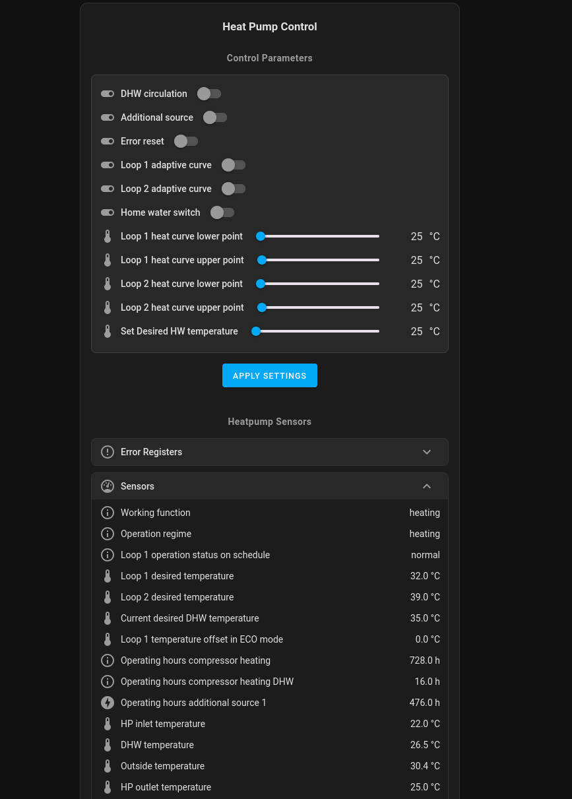
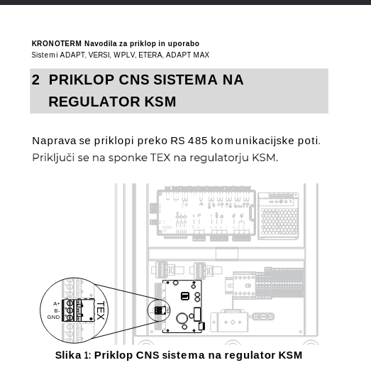
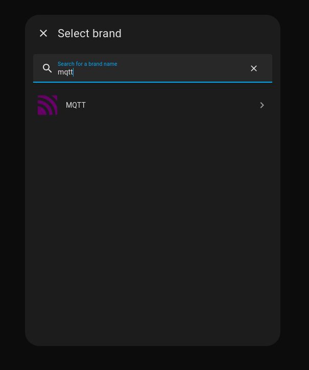
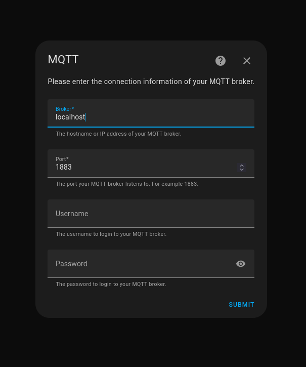
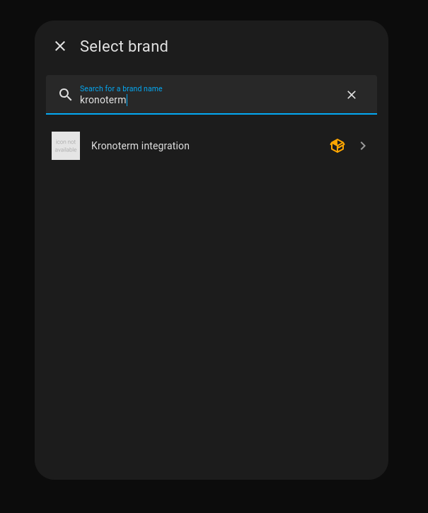
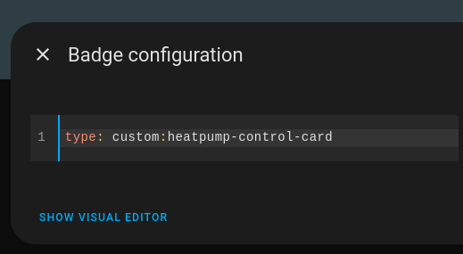
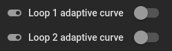
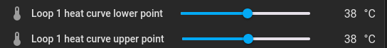
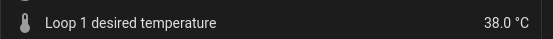
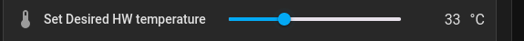

# kronoterm-mqtt-heatpump-regulation

This integration allows for control of Kronoterm heat pump systems through Home Assistant.

## Hardware setup

Kronoterm systems which expose a TEX Modbus connection are supported.

More details are available in the "CNS sistem - Navodila za priklop in uporabo" document from Kronoterm.
The TEX Modbus connection should be connected to a Linux machine using a USB adapter.

## Software setup

### kronoterm2mqtt

This integration requires a intermediary component called `kronoterm2mqtt` which translates the TEX Modbus protocol to MQTT.

The `docker-compose.yml` file provided in this repository can be used to get `kronoterm2mqtt` up and running quickly with Docker Compose, together with an MQTT broker. The serial port on which the Modbus connection is available is set to `/tty/USB0` by default. You should modify `docker-compose.yml` in case you are using a different serial port.

You can use the Dockerfile provided in this repository to get Home Assistant running with this integration already installed. Otherwise, you will need to copy the `custom_components` directory manually into your Home Assistant installation.

### Home Assistant

**Before adding this integration, you must first set up the Home Assistant MQTT integration.**

If you are using the provided Docker Compose file and Home Assistant is running on the same device, you can set the MQTT broker address to `localhost`:

Afterwards, you can add the custom Kronoterm integration:

If you want to use the custom heatpump control card and it is not visible in the badge selection, you can add it manually using the below YAML snippet:

    type: custom:heatpump-control-card

## Usage

### Heating

The recommended, tested mode for temperature regulation is non-adaptive mode. This means that instead of adapting to the outside temperature, the target loop temperature will be set directly through Home Assistant.

If you want to set a target temperature in non-adaptive mode, you should check that the adaptive switch for your desired loop is set to OFF:

To apply the target temperature, you should set both the lower and upper heat curve point to the same value:

You should see the loop's desired temperature updated accordingly:

### Home water

To enable home water function, you should first check that the Home water switch is enabled:

If this switch is enabled, then the desired DHW temperature should be updated according to the slider.

